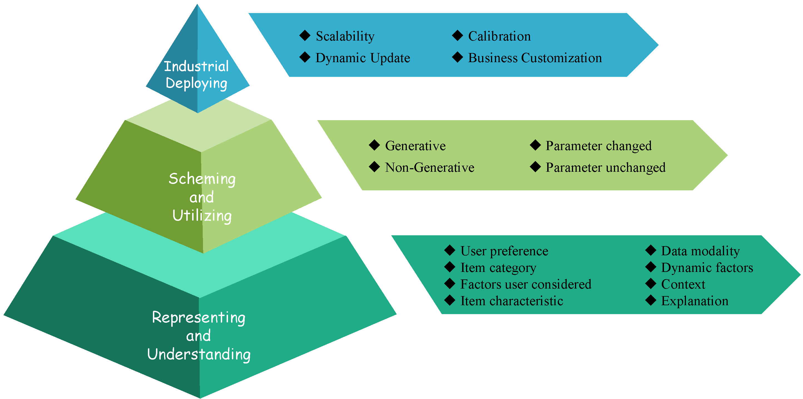
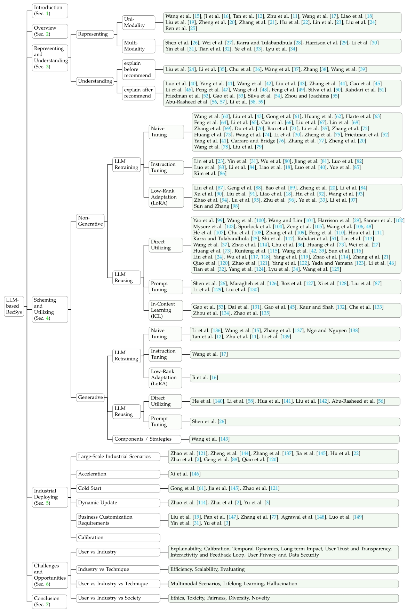
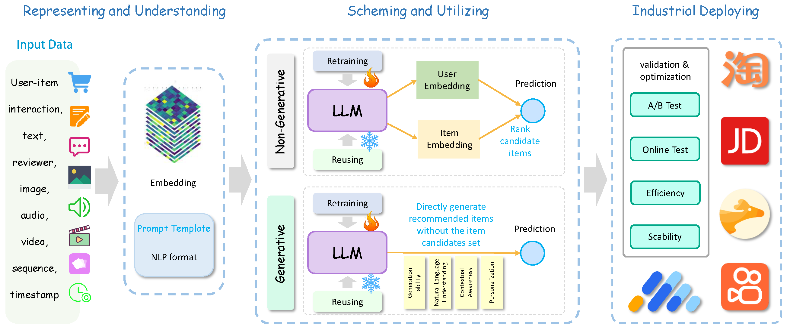
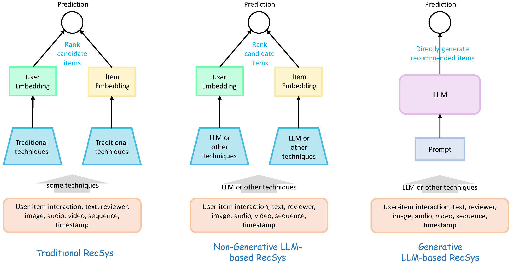
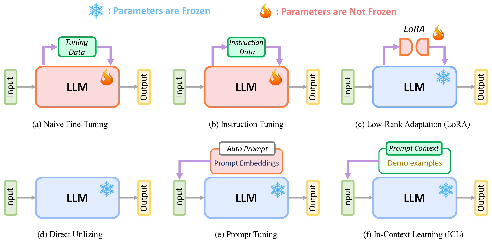
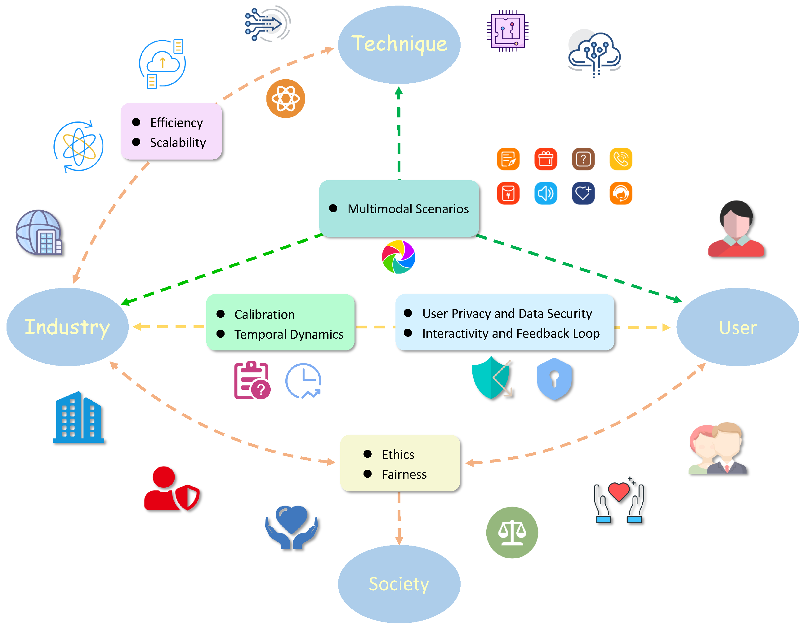

# Towards Next-Generation LLM-based Recommender Systems: A Survey and Beyond
The official GitHub page for the survey paper "Towards Next-Generation LLM-based Recommender Systems: A Survey and Beyond".

## Introduction

### Structure

### Pipeline

### Different paradigm

### LLM-using

## Representing and Understanding
### Representing
#### Uni-Modality
1. [LLaRA: Large Language-Recommendation Assistant](https://dl.acm.org/doi/abs/10.1145/3626772.3657690)
2. [DRDT: Dynamic Reflection with Divergent Thinking for LLM-based Sequential Recommendation](https://arxiv.org/abs/2312.11336)
3. [Modeling User Viewing Flow using Large Language Models for Article Recommendation](https://dl.acm.org/doi/abs/10.1145/3589335.3648305)
4. [Harnessing Large Language Models for Text-Rich Sequential Recommendation](https://dl.acm.org/doi/abs/10.1145/3589334.3645358)
5. [FineRec: Exploring Fine-grained Sequential Recommendation](https://dl.acm.org/doi/abs/10.1145/3626772.3657761)
6. [Enhancing Sequential Recommendation via LLM-based Semantic Embedding Learning](https://dl.acm.org/doi/abs/10.1145/3589335.3648307)
7. [A Multi-facet Paradigm to Bridge Large Language Model and Recommendation](https://arxiv.org/abs/2310.06491)
8. [Understanding Before Recommendation: Semantic Aspect-Aware Review Exploitation via Large Language Models](https://arxiv.org/abs/2312.16275)
9. [Representation Learning with Large Language Models for Recommendation](https://dl.acm.org/doi/abs/10.1145/3589334.3645458)
10. [LLM-Enhanced User-Item Interactions: Leveraging Edge Information for Optimized Recommendations](https://arxiv.org/abs/2402.09617)
11. [GenRec: Large Language Model for Generative Recommendation](https://link.springer.com/chapter/10.1007/978-3-031-56063-7_42)
12. [IDGenRec: LLM-RecSys Alignment with Textual ID Learning](https://dl.acm.org/doi/abs/10.1145/3626772.3657821)
13. [Collaborative Large Language Model for Recommender Systems](https://dl.acm.org/doi/abs/10.1145/3589334.3645347)
14. [Multiple Key-value Strategy in Recommendation Systems Incorporating Large Language Model](https://arxiv.org/abs/2310.16409)

#### Multi-Modality
1. [LLMRec: Large Language Models with Graph Augmentation for Recommendation](https://dl.acm.org/doi/abs/10.1145/3616855.3635853)
2. [InteraRec: Interactive Recommendations Using Multimodal Large Language Models](https://link.springer.com/chapter/10.1007/978-981-97-2650-9_3)
3. [Zero-Shot Recommendations with Pre-Trained Large Language Models for Multimodal Nudging](https://ieeexplore.ieee.org/abstract/document/10411560)
4. [Large Language Models for Next Point-of-Interest Recommendation](https://dl.acm.org/doi/abs/10.1145/3626772.3657840)
5. [Heterogeneous Knowledge Fusion: A Novel Approach for Personalized Recommendation via LLM](https://dl.acm.org/doi/abs/10.1145/3604915.3608874)
6. [MMREC: LLM Based Multi-Modal Recommender System](https://arxiv.org/abs/2408.04211)
7. [Harnessing Multimodal Large Language Models for Multimodal Sequential Recommendation](https://arxiv.org/abs/2408.09698)
8. [X-Reflect: Cross-Reflection Prompting for Multimodal Recommendation](https://arxiv.org/abs/2408.15172)

### Understanding
#### 'explain' before recommendation
1. [Understanding Before Recommendation: Semantic Aspect-Aware Review Exploitation via Large Language Models](https://arxiv.org/abs/2312.16275)
2. [Learning Structure and Knowledge Aware Representation with Large Language Models for Concept Recommendation](https://arxiv.org/abs/2405.12442)
3. 
4. 
5. 
6. 

#### explain after recommendation

## Scheming and Utilizing

### Non-Generative LLM-based Approaches

### Generative LLM-based Approaches
#### LLM Retraing
##### Naive Fine-Tuning
1. [GPT4Rec: A Generative Framework for Personalized Recommendation and User Interests Interpretation](https://arxiv.org/abs/2304.03879)
2. [LLM-Enhanced User-Item Interactions: Leveraging Edge Information for Optimized Recommendations](https://arxiv.org/abs/2402.09617)
3. [RecGPT: Generative Personalized Prompts for Sequential Recommendation via ChatGPT Training Paradigm](https://arxiv.org/abs/2404.08675)
4. [RecGPT: Generative Pre-training for Text-based Recommendation](https://arxiv.org/abs/2405.12715)
5. [IDGenRec: LLM-RecSys Alignment with Textual ID Learning](https://dl.acm.org/doi/abs/10.1145/3626772.3657821)
6. [Collaborative large language model for recommender systems](https://dl.acm.org/doi/abs/10.1145/3589334.3645347)
7. [CALRec: Contrastive Alignment of Generative LLMs For Sequential Recommendation](https://arxiv.org/abs/2405.02429)
##### Instruction Tuning
1. [Multiple Key-Value Strategy in Recommendation Systems Incorporating Large Language Model](https://arxiv.org/abs/2310.16409)
##### LoRA
1. [Genrec: Large Language Model for Generative Recommendation](https://link.springer.com/chapter/10.1007/978-3-031-56063-7_42)

#### LLM Reusing
##### Direct Utilizing
1. [How to Index Item IDs for Recommendation Foundation Models](https://dl.acm.org/doi/abs/10.1145/3624918.3625339)
2. [Supporting Student Decisions on Learning Recommendations: An LLM-based Chatbot with Knowledge Graph Contextualization for Conversational Explainability and Mentoring](https://arxiv.org/abs/2401.08517)
3. [Large Language Models as Zero-Shot Conversational Recommenders](https://dl.acm.org/doi/abs/10.1145/3583780.3614949)
4. [Bookgpt: A General Framework for Book Recommendation Empowered by Large Language Model]()
5. [ONCE: Boosting Content-based Recommendation with Both Open- and Closed-source Large Language Models](https://dl.acm.org/doi/abs/10.1145/3616855.3635845)
##### Prompt Tuning
1. [PMG: Personalized Multimodal Generation with Large Language Models](https://dl.acm.org/doi/abs/10.1145/3589334.3645633)
##### Components or Strategies for Generative Recommendation
1. [Learnable Tokenizer for LLM-based Generative Recommendation](https://arxiv.org/abs/2405.07314)

## Industrial Deploying

1. [Breaking the Barrier: Utilizing Large Language Models for Industrial Recommendation Systems through an Inferential Knowledge Graph](https://arxiv.org/abs/2402.13750)
2. [A Large Language Model Enhanced Sequential Recommender for Joint Video and Comment Recommendation](https://arxiv.org/abs/2403.13574)
3. [RecGPT: Generative Personalized Prompts for Sequential Recommendation via ChatGPT Training Paradigm](https://arxiv.org/abs/2404.08675)
4. [Knowledge Adaptation from Large Language Model to Recommendation for Practical Industrial Application](https://arxiv.org/abs/2405.03988)
5. [Enhancing Sequential Recommendation via LLM-based Semantic Embedding Learning](https://dl.acm.org/doi/abs/10.1145/3589335.3648307)
6. [Actions speak louder than words: Trillion-parameter sequential transducers for generative recommendations](https://arxiv.org/abs/2402.17152)
7. [Breaking the length barrier: LLM-Enhanced CTR Prediction in Long Textual User Behaviors](https://dl.acm.org/doi/abs/10.1145/3626772.3657974)
8. [LLM4SBR: A Lightweight and Effective Framework for Integrating Large Language Models in Session-based Recommendation](https://arxiv.org/abs/2402.13840)
9. [A Decoding Acceleration Framework for Industrial Deployable LLM-based Recommender Systems](https://arxiv.org/abs/2408.05676)
10. [An Unified Search and Recommendation Foundation Model for Cold-Start Scenario](https://dl.acm.org/doi/abs/10.1145/3583780.3614657)
11. [Knowledge Adaptation from Large Language Model to Recommendation for Practical Industrial Application](https://arxiv.org/abs/2405.03988)
12. [DynLLM: When Large Language Models Meet Dynamic Graph Recommendation](https://arxiv.org/abs/2405.07580)
13. [COSMO: A large-scale e-commerce common sense knowledge generation and serving system at Amazon](https://dl.acm.org/doi/abs/10.1145/3626246.3653398)
14. [Modeling User Viewing Flow using Large Language Models for Article Recommendation](https://dl.acm.org/doi/abs/10.1145/3589335.3648305)
15. [Ad Recommendation in a Collapsed and Entangled World](https://dl.acm.org/doi/abs/10.1145/3637528.3671607)
16. [NoteLLM: A Retrievable Large Language Model for Note Recommendation](https://dl.acm.org/doi/abs/10.1145/3589335.3648314)
17. [Beyond Labels: Leveraging Deep Learning and LLMs for Content Metadata](https://dl.acm.org/doi/abs/10.1145/3604915.3608883)
18. [TRAWL: External Knowledge-Enhanced Recommendation with LLM Assistance](https://arxiv.org/abs/2403.06642)
19. [Heterogeneous Knowledge Fusion: A Novel Approach for Personalized Recommendation via LLM](https://dl.acm.org/doi/abs/10.1145/3604915.3608874)

## Challenges

