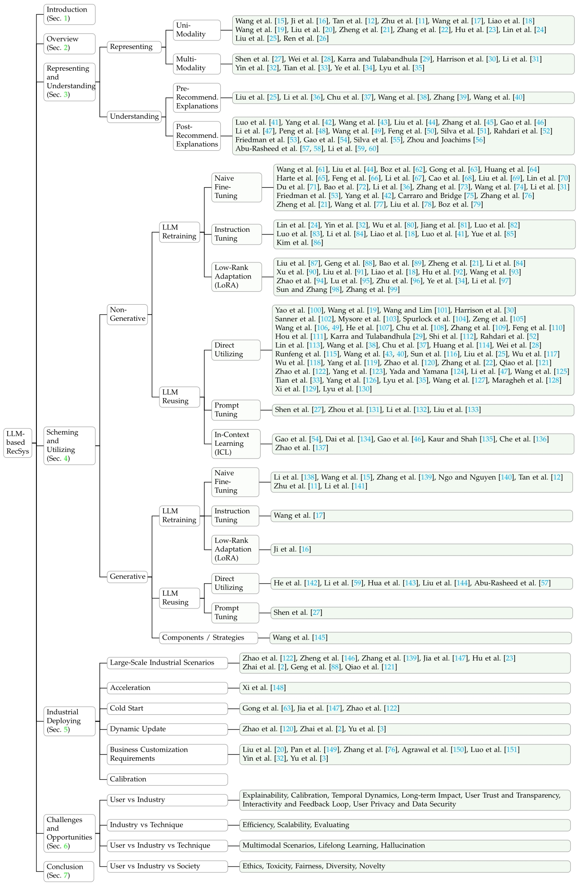

# Towards Next-Generation LLM-based Recommender Systems: A Survey and Beyond
The official GitHub page for the survey paper "Towards Next-Generation LLM-based Recommender Systems: A Survey and Beyond".

[[arXiv: https://arxiv.org/abs/2410.19744]](https://arxiv.org/abs/2410.19744)


## Basic Information
<p align="center">
    
</p>


## Introduction
<p align="center">
    
</p>


### The comparison between this work and existing surveys

| **Paper**                                                                                   | **Non-Gen. RS** | **Gen. RS** | **Scen.**                  | **Aca.** | **Ind.** | **Pipeline**                                                                             | **Highlights**                                                                                                                              |
|---------------------------------------------------------------------------------------------|-------|-----------|-------------------------------------|----------|-----------|------------------------------------------------------------------------------------------------|---------------------------------------------------------------------------------------------------------------------------------------------|
| 'A survey on large language models for recommendation'                                      | ✅    | ✅       | common (all kinds)                  | ✅        |           | (1) Discriminative LLM4REC (2) Generative LLM4REC Modeling Paradigms: (i) LLM Embeddings + RS (ii) LLM Tokens + RS (iii) LLM as RS | focuses on expanding the capacity of language models                                                  |
| 'How Can Recommender Systems Benefit from Large Language Models: A Survey'                  | ✅    |          | common (all kinds)                   |          | ✅        | (1) Where to adapt to LLM (2) How to adapt to LLM                                              | from the angle of the whole pipeline in industrial recommender systems                                                                    |
| 'A Survey on Large Language Models for Personalized and Explainable Recommendations'        | ✅    |          | personalized and explainable RecSys | ✅        |           | (1) Explanation Generating for Recommendation                                                  | focuses on utilizing LLMs for personalized explanation generating task                                                                     |
| 'Recommender systems in the era of large language models (llms)'                            | ✅    |          | common (all kinds)                  | ✅        |           | (1) Pre-training (2) Fine-tuning (3) Prompting                                                 | comprehensively reviews such domain-specific techniques for adapting LLMs to recommendations                                               |
| 'A Review of Modern Recommender Systems Using Generative Models (Gen-RecSys)'               |       | ✅       | (1) interaction-driven (2) text-driven (3) multimodal | ✅  |      | (1) Generative Models for Interaction-Driven Recommendation (2) Large Language Models in Recommendation (3) Generative Multimodal Recommendation Systems | aims to connect the key advancements in RS using Generative Models (Gen-RecSys)     |
| Multimodal Pretraining, Adaptation, and Generation for Recommendation: A Survey             | ✅    |          | multimodal recommendation           | ✅        |           | (1) Multimodal Pretraining for Recommendation (2) Multimodal Adaption for Recommendation (3) Multimodal Generation for Recommendation | seeks to provide a comprehensive exploration of the latest advancements and future trajectories in multimodal pretraining, adaptation, and generation techniques, as well as their applications to recommender systems |
| 'Large language models for generative recommendation: A survey and visionary discussions'   |       | ✅       | common (all kinds)                  | ✅        |           | (1) ID Creation Methods (2) How to Do Generative Recommendation                                 | reviews the recent progress of LLM-based generative recommendation and provides a general formulation for each generative recommendation task according to relevant research |
| **Ours**                                                                                    | ✅   | ✅       | common (all kinds)                   | ✅        | ✅       | (1) Representing and Understanding (2) Scheming and Utilizing (3) Industrial Deploying          | (1) reviews existing works from the perspective of recommender system community (2) clearly discuss the gap from academic research to industrial application |

(Gen.: Generative, RS: Recommendation System, Scen.: Scenarios, Aca.: Academic, Ind.: Industrial)


### Structure


### Pipeline


### Different paradigm


### LLM-using


## Representing and Understanding
### Representing
#### Uni-Modality
1. [LLaRA: Large Language-Recommendation Assistant](https://dl.acm.org/doi/abs/10.1145/3626772.3657690)
2. [DRDT: Dynamic Reflection with Divergent Thinking for LLM-based Sequential Recommendation](https://arxiv.org/abs/2312.11336)
3. [Modeling User Viewing Flow using Large Language Models for Article Recommendation](https://dl.acm.org/doi/abs/10.1145/3589335.3648305)
4. [Harnessing Large Language Models for Text-Rich Sequential Recommendation](https://dl.acm.org/doi/abs/10.1145/3589334.3645358)
5. [FineRec: Exploring Fine-grained Sequential Recommendation](https://dl.acm.org/doi/abs/10.1145/3626772.3657761)
6. [Enhancing Sequential Recommendation via LLM-based Semantic Embedding Learning](https://dl.acm.org/doi/abs/10.1145/3589335.3648307)
7. [A Multi-facet Paradigm to Bridge Large Language Model and Recommendation](https://arxiv.org/abs/2310.06491)
8. [Understanding Before Recommendation: Semantic Aspect-Aware Review Exploitation via Large Language Models](https://arxiv.org/abs/2312.16275)
9. [Representation Learning with Large Language Models for Recommendation](https://dl.acm.org/doi/abs/10.1145/3589334.3645458)
10. [LLM-Enhanced User-Item Interactions: Leveraging Edge Information for Optimized Recommendations](https://arxiv.org/abs/2402.09617)
11. [GenRec: Large Language Model for Generative Recommendation](https://link.springer.com/chapter/10.1007/978-3-031-56063-7_42)
12. [IDGenRec: LLM-RecSys Alignment with Textual ID Learning](https://dl.acm.org/doi/abs/10.1145/3626772.3657821)
13. [Collaborative Large Language Model for Recommender Systems](https://dl.acm.org/doi/abs/10.1145/3589334.3645347)
14. [Multiple Key-value Strategy in Recommendation Systems Incorporating Large Language Model](https://arxiv.org/abs/2310.16409)


#### Multi-Modality
1. [LLMRec: Large Language Models with Graph Augmentation for Recommendation](https://dl.acm.org/doi/abs/10.1145/3616855.3635853)
2. [InteraRec: Interactive Recommendations Using Multimodal Large Language Models](https://link.springer.com/chapter/10.1007/978-981-97-2650-9_3)
3. [Zero-Shot Recommendations with Pre-Trained Large Language Models for Multimodal Nudging](https://ieeexplore.ieee.org/abstract/document/10411560)
4. [Large Language Models for Next Point-of-Interest Recommendation](https://dl.acm.org/doi/abs/10.1145/3626772.3657840)
5. [Heterogeneous Knowledge Fusion: A Novel Approach for Personalized Recommendation via LLM](https://dl.acm.org/doi/abs/10.1145/3604915.3608874)
6. [MMREC: LLM Based Multi-Modal Recommender System](https://arxiv.org/abs/2408.04211)
7. [Harnessing Multimodal Large Language Models for Multimodal Sequential Recommendation](https://arxiv.org/abs/2408.09698)
8. [X-Reflect: Cross-Reflection Prompting for Multimodal Recommendation](https://arxiv.org/abs/2408.15172)


### Understanding
#### Pre-Recommendation Explanations
1. [Understanding Before Recommendation: Semantic Aspect-Aware Review Exploitation via Large Language Models](https://arxiv.org/abs/2312.16275)
2. [Learning Structure and Knowledge Aware Representation with Large Language Models for Concept Recommendation](https://arxiv.org/abs/2405.12442)
3. [LLM-Guided Multi-View Hypergraph Learning for Human-Centric Explainable Recommendation](https://arxiv.org/abs/2401.08217)
4. [RDRec: Rationale Distillation for LLM-based Recommendation](https://arxiv.org/abs/2405.10587)
5. [User-Centric Conversational Recommendation: Adapting the Need of User with Large Language Models](https://dl.acm.org/doi/abs/10.1145/3604915.3608885)
6. [LLMRG: Improving Recommendations through Large Language Model Reasoning Graphs](https://ojs.aaai.org/index.php/AAAI/article/view/29887)

#### Post-Recommendation Explanations
1. [Unlocking the Potential of Large Language Models for Explainable Recommendations](https://arxiv.org/abs/2312.15661)
2. [Fine-Tuning Large Language Model Based Explainable Recommendation with Explainable Quality Reward](https://ojs.aaai.org/index.php/AAAI/article/view/28777)
3. [LLM4Vis: Explainable Visualization Recommendation using ChatGPT](https://arxiv.org/abs/2310.07652)
4. [Navigating User Experience of ChatGPT-based Conversational Recommender Systems: The Effects of Prompt Guidance and Recommendation Domain](https://arxiv.org/abs/2405.13560)
5. [DRE: Generating Recommendation Explanations by Aligning Large Language Models at Data-level](https://arxiv.org/abs/2404.06311)
6. [Uncertainty-Aware Explainable Recommendation with Large Language Models](https://arxiv.org/abs/2402.03366)
7. [Where to Move Next: Zero-shot Generalization of LLMs for Next POI Recommendation](https://ieeexplore.ieee.org/abstract/document/10605522)
8. [Leveraging ChatGPT for Automated Human-centered Explanations in Recommender Systems](https://dl.acm.org/doi/abs/10.1145/3640543.3645171)
9. [Logic-Scaffolding: Personalized Aspect-Instructed Recommendation Explanation Generation using LLMs](https://dl.acm.org/doi/abs/10.1145/3616855.3635689)
10. [Leveraging Large Language Models in Conversational Recommender Systems](https://arxiv.org/abs/2305.07961)
11. [Chat-REC: Towards Interactive and Explainable LLMs-Augmented Recommender System](https://arxiv.org/abs/2303.14524)
12. [Leveraging Large Language Models for Recommendation and Explanation](https://ceur-ws.org/Vol-3534/paper6.pdf)
13. [GPT as a Baseline for Recommendation Explanation Texts](https://arxiv.org/abs/2309.08817)
14. [Supporting Student Decisions on Learning Recommendations: An LLM-Based Chatbot with Knowledge Graph Contextualization for Conversational Explainability and Mentoring](https://arxiv.org/abs/2401.08517)
15. [Knowledge Graphs as Context Sources for LLM-Based Explanations of Learning Recommendations](https://arxiv.org/abs/2403.03008)
16. [BookGPT: A General Framework for Book Recommendation Empowered by Large Language Model](https://arxiv.org/abs/2305.15673)
17. [LLMRec: Benchmarking Large Language Models on Recommendation Task](https://arxiv.org/abs/2308.12241)
18. [PAP-REC: Personalized Automatic Prompt for Recommendation Language Model](https://arxiv.org/abs/2402.00284)
19. [RecMind: Large Language Model Powered Agent For Recommendation](https://arxiv.org/abs/2308.14296)
20. [Prompt Distillation for Efficient LLM-based Recommendation](https://dl.acm.org/doi/abs/10.1145/3583780.3615017)


## Scheming and Utilizing

### Non-Generative LLM-based Approaches
#### LLM Retraing
##### Naive Fine-Tuning
1. [Rethinking Large Language Model Architectures for Sequential Recommendations](https://arxiv.org/abs/2402.09543)
2. [LLMRec: Benchmarking Large Language Models on Recommendation Task](https://arxiv.org/abs/2308.12241)
3. [Improving Sequential Recommendations with LLMs](https://arxiv.org/abs/2402.01339)
4. [An Unified Search and Recommendation Foundation Model for Cold-Start Scenario](https://dl.acm.org/doi/abs/10.1145/3583780.3614657)
5. [Recommender AI Agent: Integrating Large Language Models for Interactive Recommendations](https://arxiv.org/abs/2308.16505)
6. [Leveraging Large Language Models for Sequential Recommendation](https://dl.acm.org/doi/abs/10.1145/3604915.3610639)
7. [A Large Language Model Enhanced Conversational Recommender System](https://arxiv.org/abs/2308.06212)
8. [Exploring Fine-tuning ChatGPT for News Recommendation](https://arxiv.org/abs/2311.05850)
9. [Aligning Large Language Models with Recommendation Knowledge](https://arxiv.org/abs/2404.00245)
10. [Conversational Recommender System and Large Language Model Are Made for Each Other in E-commerce Pre-sales Dialogue](https://arxiv.org/abs/2310.14626)
11. [Data-Efficient Fine-Tuning for LLM-based Recommendation](https://dl.acm.org/doi/abs/10.1145/3626772.3657807)
12. [Large Language Model with Graph Convolution for Recommendation](https://arxiv.org/abs/2402.08859)
13. [A Bi-Step Grounding Paradigm for Large Language Models in Recommendation Systems](https://arxiv.org/abs/2308.08434)
14. [Learning Structure and Knowledge Aware Representation with Large Language Models for Concept Recommendation](https://arxiv.org/abs/2405.12442)
15. [LoRec: Large Language Model for Robust Sequential Recommendation against Poisoning Attacks](https://arxiv.org/abs/2401.17723)
16. [To Recommend or Not: Recommendability Identification in Conversations with Pre-trained Language Models](https://arxiv.org/abs/2403.18628)
17. [Large Language Models for Next Point-of-Interest Recommendation](https://dl.acm.org/doi/abs/10.1145/3626772.3657840)
18. [Leveraging large language models in conversational recommender systems](https://arxiv.org/abs/2305.07961)
19. [Fine-Tuning Large Language Model Based Explainable Recommendation with Explainable Quality Reward](https://ojs.aaai.org/index.php/AAAI/article/view/28777)
20. [Enhancing Recommendation Diversity by Re-ranking with Large Language Models](https://arxiv.org/abs/2401.11506)
21. [NoteLLM: A Retrievable Large Language Model for Note Recommendation](https://dl.acm.org/doi/abs/10.1145/3589335.3648314)
22. [Harnessing Large Language Models for Text-Rich Sequential Recommendation](https://dl.acm.org/doi/abs/10.1145/3589334.3645358)
23. [LLM4DSR: Leveraing Large Language Model for Denoising Sequential Recommendation](https://arxiv.org/abs/2408.08208)
24. [Beyond Inter-Item Relations: Dynamic Adaptive Mixture-of-Experts for LLM-Based Sequential Recommendation](https://arxiv.org/abs/2408.07427)
25. [Improving Sequential Recommendations with LLMs](https://arxiv.org/abs/2402.01339)

##### Instruction Tuning
1. [A Multi-facet Paradigm to Bridge Large Language Model and Recommendation](https://arxiv.org/abs/2310.06491v1)
2. [Heterogeneous Knowledge Fusion: A Novel Approach for Personalized Recommendation via LLM](https://dl.acm.org/doi/abs/10.1145/3604915.3608874)
3. [Exploring Large Language Model for Graph Data Understanding in Online Job Recommendations](https://ojs.aaai.org/index.php/AAAI/article/view/28769)
4. [Item-side Fairness of Large Language Model-based Recommendation System](https://dl.acm.org/doi/abs/10.1145/3589334.3648158)
5. [Integrating Large Language Models into Recommendation via Mutual Augmentation and Adaptive Aggregation](https://arxiv.org/abs/2401.13870)
6. [RecRanker: Instruction Tuning Large Language Model as Ranker for Top-k Recommendation](https://arxiv.org/abs/2312.16018)
7. [E4SRec: An Elegant Effective Efficient Extensible Solution of Large Language Models for Sequential Recommendation](https://arxiv.org/abs/2312.02443)
8. [LLaRA: Large Language-Recommendation Assistant](https://dl.acm.org/doi/abs/10.1145/3626772.3657690)
9. [Unlocking the Potential of Large Language Models for Explainable Recommendations](https://arxiv.org/abs/2312.15661)
10. [LlamaRec: Two-Stage Recommendation using Large Language Models for Ranking](https://arxiv.org/abs/2311.02089)
11. [Review-driven Personalized Preference Reasoning with Large Language Models for Recommendation](https://arxiv.org/abs/2408.06276)

##### Low-Rank Adapataion (LoRA)
1. [ONCE: Boosting Content-based Recommendation with Both Open- and Closed-source Large Language Models](https://dl.acm.org/doi/abs/10.1145/3616855.3635845)
2. [Breaking the Length Barrier: LLM-Enhanced CTR Prediction in Long Textual User Behaviors](https://dl.acm.org/doi/abs/10.1145/3626772.3657974)
3. [TALLRec: An Effective and Efficient Tuning Framework to Align Large Language Model with Recommendation](https://dl.acm.org/doi/abs/10.1145/3604915.3608857)
4. [Harnessing Large Language Models for Text-Rich Sequential Recommendation](https://dl.acm.org/doi/abs/10.1145/3589334.3645358)
5. [E4SRec: An Elegant Effective Efficient Extensible Solution of Large Language Models for Sequential Recommendation](https://arxiv.org/abs/2312.02443)
6. [Enhancing Content-based Recommendation via Large Language Model](https://arxiv.org/abs/2404.00236)
7. [Large Language Model Distilling Medication Recommendation Model](https://arxiv.org/abs/2402.02803)
8. [LLaRA: Large Language-Recommendation Assistant](https://dl.acm.org/doi/abs/10.1145/3626772.3657690)
9. [Exact and Efficient Unlearning for Large Language Model-based Recommendation](https://arxiv.org/abs/2404.10327)
10. [Towards Efficient and Effective Unlearning of Large Language Models for Recommendation](https://arxiv.org/abs/2403.03536)
11. [LLM-based Federated Recommendation](https://arxiv.org/abs/2402.09959)
12. [Aligning Large Language Models for Controllable Recommendations](https://arxiv.org/abs/2403.05063)
13. [Lifelong Personalized Low-Rank Adaptation of Large Language Models for Recommendation](https://arxiv.org/abs/2408.03533)
14. [Harnessing Multimodal Large Language Models for Multimodal Sequential Recommendation](https://arxiv.org/abs/2408.09698)
15. [GANPrompt: Enhancing Robustness in LLM-Based Recommendations with GAN-Enhanced Diversity Prompts](https://arxiv.org/abs/2408.09671)
16. [DELRec: Distilling Sequential Pattern to Enhance LLM-based Recommendation](https://arxiv.org/abs/2406.11156)
17. [CoLLM: Integrating Collaborative Embeddings into Large Language Models for Recommendation]()


#### LLM Reusing
##### Direct Utilizing
1. [Knowledge Plugins: Enhancing Large Language Models for Domain-Specific Recommendations](https://arxiv.org/abs/2311.10779)
2. [DRDT: Dynamic Reflection with Divergent Thinking for LLM-based Sequential Recommendation](https://arxiv.org/abs/2312.11336)
3. [Zero-Shot Next-Item Recommendation using Large Pretrained Language Models](https://arxiv.org/abs/2304.03153)
4. [Zero-Shot Recommendations with Pre-Trained Large Language Models for Multimodal Nudging](https://ieeexplore.ieee.org/abstract/document/10411560)
5. [Large Language Models are Competitive Near Cold-start Recommenders for Language- and Item-based Preferences](https://dl.acm.org/doi/abs/10.1145/3604915.3608845)
6. [Large Language Model Augmented Narrative Driven Recommendations](https://dl.acm.org/doi/abs/10.1145/3604915.3608829)
7. [ChatGPT for Conversational Recommendation: Refining Recommendations by Reprompting with Feedback](https://arxiv.org/abs/2401.03605)
8. [Federated Recommendation via Hybrid Retrieval Augmented Generation](https://arxiv.org/abs/2403.04256)
9. [Re2LLM: Reflective Reinforcement Large Language Model for Session-based Recommendation](https://arxiv.org/abs/2403.16427)
10. [RecMind: Large Language Model Powered Agent For Recommendation](https://arxiv.org/abs/2308.14296)
11. [Reindex-Then-Adapt: Improving Large Language Models for Conversational Recommendation](https://arxiv.org/abs/2405.12119)
12. [Improve Temporal Awareness of LLMs for Sequential Recommendation](https://arxiv.org/abs/2405.02778)
13. [Tired of Plugins? Large Language Models Can Be End-To-End Recommenders](https://arxiv.org/abs/2404.00702)
14. [Where to Move Next: Zero-shot Generalization of LLMs for Next POI Recommendation](https://ieeexplore.ieee.org/abstract/document/10605522)
15. [Large Language Models are Zero-Shot Rankers for Recommender Systems](https://link.springer.com/chapter/10.1007/978-3-031-56060-6_24)
16. [InteraRec: Interactive Recommendations Using Multimodal Large Language Models](https://link.springer.com/chapter/10.1007/978-981-97-2650-9_3)
17. [Large Language Models are Learnable Planners for Long-Term Recommendation](https://dl.acm.org/doi/abs/10.1145/3626772.3657683)
18. [Logic-Scaffolding: Personalized Aspect-Instructed Recommendation Explanation Generation using LLMs](https://dl.acm.org/doi/abs/10.1145/3616855.3635689)
19. [ReLLa: Retrieval-enhanced Large Language Models for Lifelong Sequential Behavior Comprehension in Recommendation](https://dl.acm.org/doi/abs/10.1145/3589334.3645467)
20. [RDRec: Rationale Distillation for LLM-based Recommendation](https://arxiv.org/abs/2405.10587)
21. [LLM-Guided Multi-View Hypergraph Learning for Human-Centric Explainable Recommendation](https://arxiv.org/abs/2401.08217)
22. [Large Language Model Interaction Simulator for Cold-Start Item Recommendation](https://arxiv.org/abs/2402.09176)
23. [LLMRec: Large Language Models with Graph Augmentation for Recommendation](https://dl.acm.org/doi/abs/10.1145/3616855.3635853)
24. [LKPNR: LLM and KG for Personalized News Recommendation Framework](https://arxiv.org/abs/2308.12028)
25. [LLM4Vis: Explainable Visualization Recommendation using ChatGPT](https://arxiv.org/abs/2310.07652)
26. [LLMRG: Improving Recommendations through Large Language Model Reasoning Graphs](https://ojs.aaai.org/index.php/AAAI/article/view/29887)
27. [Large Language Models for Intent-Driven Session Recommendations](https://dl.acm.org/doi/abs/10.1145/3626772.3657688)
28. [Understanding Before Recommendation: Semantic Aspect-Aware Review Exploitation via Large Language Models](https://arxiv.org/abs/2312.16275)
29. [Leveraging Large Language Models (LLMs) to Empower Training-Free Dataset Condensation for Content-Based Recommendation](https://arxiv.org/abs/2310.09874)
30. [CoRAL: Collaborative Retrieval-Augmented Large Language Models Improve Long-tail Recommendation](https://dl.acm.org/doi/abs/10.1145/3637528.3671901)
31. [Common Sense Enhanced Knowledge-based Recommendation with Large Language Model](https://arxiv.org/abs/2403.18325)
32. [DynLLM: When Large Language Models Meet Dynamic Graph Recommendation](https://arxiv.org/abs/2405.07580)
33. [FineRec: Exploring Fine-grained Sequential Recommendation](https://dl.acm.org/doi/abs/10.1145/3626772.3657761)
34. [LLM4SBR: A Lightweight and Effective Framework for Integrating Large Language Models in Session-based Recommendation](https://arxiv.org/abs/2402.13840)
35. [Breaking the Barrier: Utilizing Large Language Models for Industrial Recommendation Systems through an Inferential Knowledge Graph](https://arxiv.org/abs/2402.13750)
36. [Sequential Recommendation with Latent Relations based on Large Language Model](https://dl.acm.org/doi/abs/10.1145/3626772.3657762)
37. [News Recommendation with Category Description by a Large Language Model](https://arxiv.org/abs/2405.13007)
38. [PAP-REC: Personalized Automatic Prompt for Recommendation Language Model](https://arxiv.org/abs/2402.00284)
39. [Large Language Models as Data Augmenters for Cold-Start Item Recommendation](https://dl.acm.org/doi/abs/10.1145/3589335.3651532)
40. [MMREC: LLM Based Multi-Modal Recommender System](https://arxiv.org/abs/2408.04211)
41. [DaRec: A Disentangled Alignment Framework for Large Language Model and Recommender System](https://arxiv.org/abs/2408.08231)
42. [X-Reflect: Cross-Reflection Prompting for Multimodal Recommendation](https://arxiv.org/abs/2408.15172)
43. [LLM4MSR: An LLM-Enhanced Paradigm for Multi-Scenario Recommendation](https://arxiv.org/abs/2406.12529)
44. [LLM-Based Aspect Augmentations for Recommendation Systems](https://openreview.net/forum?id=bStpLVqv1H#all)
45. [Towards Open-World Recommendation with Knowledge Augmentation from Large Language Models](https://arxiv.org/abs/2306.10933)
46. [LLM-Rec: Personalized Recommendation via Prompting Large Language Models](https://arxiv.org/abs/2307.15780)


##### Prompt Tuning
1. [PMG: Personalized Multimodal Generation with Large Language Models](https://dl.acm.org/doi/abs/10.1145/3589334.3645633)
2. [Language-Based User Profiles for Recommendation](https://arxiv.org/abs/2402.15623)
3. [Prompt Tuning Large Language Models on Personalized Aspect Extraction for Recommendations](https://arxiv.org/abs/2306.01475)
4. [RecPrompt: A Prompt Tuning Framework for News Recommendation Using Large Language Models](https://arxiv.org/abs/2312.10463)

##### In-Context Learning (ICL)
1. [Chat-REC: Towards Interactive and Explainable LLMs-Augmented Recommender System](https://arxiv.org/abs/2303.14524)
2. [DRE: Generating Recommendation Explanations by Aligning Large Language Models at Data-level](https://arxiv.org/abs/2404.06311)
3. [Efficient and Responsible Adaptation of Large Language Models for Robust Top-k Recommendations](https://arxiv.org/abs/2405.00824)
4. [Uncovering ChatGPT’s Capabilities in Recommender Systems](https://dl.acm.org/doi/abs/10.1145/3604915.3610646)
5. [New Community Cold-Start Recommendation: A Novel Large Language Model-based Method](https://papers.ssrn.com/sol3/papers.cfm?abstract_id=4828316)
6. [LANE: Logic Alignment of Non-tuning Large Language Models and Online Recommendation Systems for Explainable Reason Generation](https://arxiv.org/abs/2407.02833)


### Generative LLM-based Approaches
#### LLM Retraing
##### Naive Fine-Tuning
1. [GPT4Rec: A Generative Framework for Personalized Recommendation and User Interests Interpretation](https://arxiv.org/abs/2304.03879)
2. [LLM-Enhanced User-Item Interactions: Leveraging Edge Information for Optimized Recommendations](https://arxiv.org/abs/2402.09617)
3. [RecGPT: Generative Personalized Prompts for Sequential Recommendation via ChatGPT Training Paradigm](https://arxiv.org/abs/2404.08675)
4. [RecGPT: Generative Pre-training for Text-based Recommendation](https://arxiv.org/abs/2405.12715)
5. [IDGenRec: LLM-RecSys Alignment with Textual ID Learning](https://dl.acm.org/doi/abs/10.1145/3626772.3657821)
6. [Collaborative large language model for recommender systems](https://dl.acm.org/doi/abs/10.1145/3589334.3645347)
7. [CALRec: Contrastive Alignment of Generative LLMs For Sequential Recommendation](https://arxiv.org/abs/2405.02429)
##### Instruction Tuning
1. [Multiple Key-Value Strategy in Recommendation Systems Incorporating Large Language Model](https://arxiv.org/abs/2310.16409)
##### Low-Rank Adaptation (LoRA)
1. [Genrec: Large Language Model for Generative Recommendation](https://link.springer.com/chapter/10.1007/978-3-031-56063-7_42)

#### LLM Reusing
##### Direct Utilizing
1. [How to Index Item IDs for Recommendation Foundation Models](https://dl.acm.org/doi/abs/10.1145/3624918.3625339)
2. [Supporting Student Decisions on Learning Recommendations: An LLM-based Chatbot with Knowledge Graph Contextualization for Conversational Explainability and Mentoring](https://arxiv.org/abs/2401.08517)
3. [Large Language Models as Zero-Shot Conversational Recommenders](https://dl.acm.org/doi/abs/10.1145/3583780.3614949)
4. [Bookgpt: A General Framework for Book Recommendation Empowered by Large Language Model](https://arxiv.org/abs/2305.15673#:~:text=By%20building%20a%20ChatGPT-like%20book%20recommendation%20system%20(BookGPT)%20framework%20based)
5. [ONCE: Boosting Content-based Recommendation with Both Open- and Closed-source Large Language Models](https://dl.acm.org/doi/abs/10.1145/3616855.3635845)
##### Prompt Tuning
1. [PMG: Personalized Multimodal Generation with Large Language Models](https://dl.acm.org/doi/abs/10.1145/3589334.3645633)
#### Components or Strategies for Generative Recommendation
1. [Learnable Tokenizer for LLM-based Generative Recommendation](https://arxiv.org/abs/2405.07314)
<br>

### The existing LLM-based works for generative recommendations

| **Model/Paper**                                                                                           | **Task/Domain**                                          | **Data Modality**                       | **Main Techniques**                                              | **Source Code**                                                                                           |
|-----------------------------------------------------------------------------------------------------------|----------------------------------------------------------|-----------------------------------------|------------------------------------------------------------------|-----------------------------------------------------------------------------------------------------------|
| 'Multiple Key-value Strategy in Recommendation Systems Incorporating Large Language Model'                | sequential recommendation                                | multiple key-value data                 | pre-train, instruction tuning                                    | ~                                                                                                         |
| 'Large language models as zero-shot conversational recommenders'                                          | zero-shot conversational recommendation                  | text (conversational recommendation dataset) | prompt                                                      | [https://github.com/AaronHeee/LLMs-as-Zero-Shot-Conversational-RecSys](https://github.com/AaronHeee/LLMs-as-Zero-Shot-Conversational-RecSys)   |
| 'Bookgpt: A general framework for book recommendation empowered by large language model'                  | book recommendation                                      | interaction, text                       | prompt                                                           | [https://github.com/zhiyulee-RUC/bookgpt](https://github.com/zhiyulee-RUC/bookgpt)                        |
| 'How to index item ids for recommendation foundation models'                                              | sequential recommendation                                | interaction, text                       | item ID indexing                                                 | [https://github.com/Wenyueh/LLM-RecSys-ID](https://github.com/Wenyueh/LLM-RecSys-ID)                      |
| 'Supporting student decisions on learning recommendations: An llm-based chatbot with knowledge graph contextualization for conversational explainability and mentoring'   | learning recommendation     | graph data, text       | ~                                              | ~                                                                                                         |
| 'GPT4Rec: A generative framework for personalized recommendation and user interests interpretation'       | next-item prediction                                     | interaction, item title                 | prompt, pre-train, fine-tune                                     | ~                                                                                                         |
| 'LLM-Enhanced User-Item Interactions: Leveraging Edge Information for Optimized Recommendations'          | item recommendation                                      | interaction                             | prompt, pre-train, fine-tune                                     | [https://github.com/anord-wang/LLM4REC.git](https://github.com/anord-wang/LLM4REC.git)                    |
| 'RecGPT: Generative Personalized Prompts for Sequential Recommendation via ChatGPT Training Paradigm'     | sequential recommendation                                | sequences of words                      | prompt, pre-train, fine-tune                                     | ~                                                                                                         |
| 'RecGPT: Generative Pre-training for Text-based Recommendation'                                           | rating prediction, sequential recommendation             | text                                    | pre-train, fine-tune                                             | [https://github.com/VinAIResearch/RecGPT](https://github.com/VinAIResearch/RecGPT)                        |
| 'Genrec: Large language model for generative recommendation'                                              | movie recommendation                                     | interaction, textual-information        | prompt, pre-train, fine-tune                                     | [https://github.com/rutgerswiselab/GenRec](https://github.com/rutgerswiselab/GenRec)                      |
| 'IDGenRec: LLM-RecSys Alignment with Textual ID Learning'                                                 | sequential recommendation, zero-shot recommendation      | interaction, text                       | natural language generation                                      | [https://github.com/agiresearch/IDGenRec](https://github.com/agiresearch/IDGenRec)                        |
| 'Collaborative large language model for recommender systems'                                              | item recommendation                                      | interaction, text                       | prompt, pre-train, fine-tune                                     | [https://github.com/yaochenzhu/llm4rec](https://github.com/yaochenzhu/llm4rec)                            |
| 'PMG: Personalized Multimodal Generation with Large Language Models'                                      | personalized multimodal generation                       | text, image, audio, etc                 | prompt, pre-train, Prompt Tuning (P-Tuning V2) | [https://github.com/mindspore-lab/models/tree/master/research/huawei-noah/PMG](https://github.com/mindspore-lab/models/tree/master/research/huawei-noah/PMG) |
| 'CALRec: Contrastive Alignment of Generative LLMs For Sequential Recommendation'                          | sequential recommendation                                | interaction, text                       | pre-train, fine-tune, contrastive learning                       | ~                                                                                                         |
| 'Once: Boosting content-based recommendation with both open-and closed-source large language models'      | content-based recommendation (news recommendation, book recommendation) | interaction, text                       | prompt                                                | [https://github.com/Jyonn/ONCE](https://github.com/Jyonn/ONCE)                                        |


## Industrial Deploying
#### Large-Scale Industrial Scenarios
1. [Breaking the Barrier: Utilizing Large Language Models for Industrial Recommendation Systems through an Inferential Knowledge Graph](https://arxiv.org/abs/2402.13750)
2. [A Large Language Model Enhanced Sequential Recommender for Joint Video and Comment Recommendation](https://arxiv.org/abs/2403.13574)
3. [RecGPT: Generative Personalized Prompts for Sequential Recommendation via ChatGPT Training Paradigm](https://arxiv.org/abs/2404.08675)
4. [Knowledge Adaptation from Large Language Model to Recommendation for Practical Industrial Application](https://arxiv.org/abs/2405.03988)
5. [Enhancing Sequential Recommendation via LLM-based Semantic Embedding Learning](https://dl.acm.org/doi/abs/10.1145/3589335.3648307)
6. [Actions speak louder than words: Trillion-parameter sequential transducers for generative recommendations](https://arxiv.org/abs/2402.17152)
7. [Breaking the length barrier: LLM-Enhanced CTR Prediction in Long Textual User Behaviors](https://dl.acm.org/doi/abs/10.1145/3626772.3657974)
8. [LLM4SBR: A Lightweight and Effective Framework for Integrating Large Language Models in Session-based Recommendation](https://arxiv.org/abs/2402.13840)

#### Acceleration
1. [A Decoding Acceleration Framework for Industrial Deployable LLM-based Recommender Systems](https://arxiv.org/abs/2408.05676)

#### Cold Start
1. [An Unified Search and Recommendation Foundation Model for Cold-Start Scenario](https://dl.acm.org/doi/abs/10.1145/3583780.3614657)
2. [Knowledge Adaptation from Large Language Model to Recommendation for Practical Industrial Application](https://arxiv.org/abs/2405.03988)
3. [Breaking the Barrier: Utilizing Large Language Models for Industrial Recommendation Systems through an Inferential Knowledge Graph](https://arxiv.org/abs/2402.13750)

#### Dynamic Update
1. [DynLLM: When Large Language Models Meet Dynamic Graph Recommendation](https://arxiv.org/abs/2405.07580)
2. [Actions speak louder than words: Trillion-parameter sequential transducers for generative recommendations](https://arxiv.org/abs/2402.17152)
3. [COSMO: A large-scale e-commerce common sense knowledge generation and serving system at Amazon](https://dl.acm.org/doi/abs/10.1145/3626246.3653398)

#### Adapting to Business Customization Requirements
1. [Modeling User Viewing Flow using Large Language Models for Article Recommendation](https://dl.acm.org/doi/abs/10.1145/3589335.3648305)
2. [Ad Recommendation in a Collapsed and Entangled World](https://dl.acm.org/doi/abs/10.1145/3637528.3671607)
3. [NoteLLM: A Retrievable Large Language Model for Note Recommendation](https://dl.acm.org/doi/abs/10.1145/3589335.3648314)
4. [Beyond Labels: Leveraging Deep Learning and LLMs for Content Metadata](https://dl.acm.org/doi/abs/10.1145/3604915.3608883)
5. [TRAWL: External Knowledge-Enhanced Recommendation with LLM Assistance](https://arxiv.org/abs/2403.06642)
6. [Heterogeneous Knowledge Fusion: A Novel Approach for Personalized Recommendation via LLM](https://dl.acm.org/doi/abs/10.1145/3604915.3608874)
7. [COSMO: A large-scale e-commerce common sense knowledge generation and serving system at Amazon](https://dl.acm.org/doi/abs/10.1145/3626246.3653398)
<br>


### The existing LLM-based works which could be deployed in industry

| **Model/Paper**                                                                                                            | **Company**       | **Task/Domain**                                     | **Highlights**                                                                                          |
|----------------------------------------------------------------------------------------------------------------------------|-------------------|-----------------------------------------------------|---------------------------------------------------------------------------------------------------------|
| LLM-KERec, 'Breaking the Barrier: Utilizing Large Language Models for Industrial Recommendation Systems through an Inferential Knowledge Graph' | Ant Group         | E-commerce Recommendation      | Constructs a complementary knowledge graph by LLMs                                                      |
| LSVCR, 'A Large Language Model Enhanced Sequential Recommender for Joint Video and Comment Recommendation'                 | KuaiShou          | Video Recommendation                                | Sequential recommendation model and supplemental LLM recommender                                        |
| RecGPT, 'RecGPT: Generative Personalized Prompts for Sequential Recommendation via ChatGPT Training Paradigm'              | KuaiShou          | Sequential Recommendation                           | Models user behavior sequences using personalized prompts with ChatGPT.                                 |
| SAID, 'Enhancing sequential recommendation via llm-based semantic embedding learning'                                      | Ant Group         | Sequential Recommendation                           | Explicitly learns Semantically Aligned item ID embeddings based on texts by utilizing LLMs.             |
| BAHE, 'Breaking the length barrier: Llm-enhanced CTR prediction in long textual user behaviors'                            | Ant Group         | CTR Prediction                                      | Uses LLM's shallow layers for user behavior embeddings and deep layers for behavior interactions.       |
| 'LLM4SBR: A Lightweight and Effective Framework for Integrating Large Language Models in Session-based Recommendation'     | HuaWei            | Session-based Recommendation                        | In short sequence data, LLM can infer preferences directly leveraging its language understanding capability without fine-tuning |
| DARE, 'A Decoding Acceleration Framework for Industrial Deployable LLM-based Recommender Systems'                          | HuaWei            | CTR prediction                                      | Identifies the issue of inference efficiency during deploying LLM-based recommendations and introduces speculative decoding to accelerate recommendation knowledge generation. |
| 'An Unified Search and Recommendation Foundation Model for Cold-Start Scenario'                                            | Ant Group         | Multi-domain Recommendation                         | LLM is applied to the S\&R multi-domain foundation model to extract domain-invariant text features.     |
| LEARN, 'Knowledge Adaptation from Large Language Model to Recommendation for Practical Industrial Application'             | Kuaishou          | Sequential Recommendation                           | Integrates the open-world knowledge encapsulated in LLMs into RS.                                       |
| 'DynLLM: When Large Language Models Meet Dynamic Graph Recommendation'                                                     | Alibaba           | E-commerce Recommendations                          | Generates user profiles based on textual historical purchase records and obtaining users' embeddings by LLM. |
| HSTU, 'Actions speak louder than words: Trillion-parameter sequential transducers for generative recommendations'          | Meta              | Generating user action sequence                     | Explores the scaling laws of RS; Optimising model architecture to accelerate inference.                 |
| COSMO, 'COSMO: A large-scale e-commerce common sense knowledge generation and serving system at Amazon'                    | Amazon            | Semantic relevance and session-based recommendation | Is the first industry-scale knowledge system that adopts LLM to construct high-quality knowledge graphs and serve online applications |
| SINGLE, 'Modeling User Viewing Flow using Large Language Models for Article Recommendation'                                | Taobao, Alibaba   | Article Recommendation                              | Summarises long articles and the user constant preference from view history by gpt-3.5-turbo or ChatGLM-6B. |
| 'Ad Recommendation in a Collapsed and Entangled World'                                                                     | Tencent           | Ad Recommendation                                   | Obtains user or items embeddings by LLM.                                                                |
| NoteLLM, 'NoteLLM: A Retrievable Large Language Model for Note Recommendation'                                             | xiaohongshu.com   | Item-to-item Note Recommendation                    | Obtains article embeddings and generate hashtags/categories information by LLaMA-2.                     |
| Genre Spectrum, 'Beyond Labels: Leveraging Deep Learning and LLMs for Content Metadata'                                    | tubi.tv           | Movie & TV series Recommendation                    | Obtains content metadata embeddings by LLM.                                                             |
| TRAWL, 'TRAWL: External Knowledge-Enhanced Recommendation with LLM Assistance'                                             | WeChat, Tencent   | Article Recommendation                              | Uses Qwen1.5-7B extract knowledge from articles.                                                        |
| HKFR, 'Heterogeneous Knowledge Fusion: A Novel Approach for Personalized Recommendation via LLM'                          | Meituan            | Catering Recommendation                             | Uses heterogeneous knowledge fusion for recommendations.                                                |

## Challenges


## Cite
If you compare with, build on, or use aspects of this work, please cite the following:
```
@article{wang2024towards,
  title={Towards Next-Generation LLM-based Recommender Systems: A Survey and Beyond},
  author={Wang, Qi and Li, Jindong and Wang, Shiqi and Xing, Qianli and Niu, Runliang and Kong, He and Li, Rui and Long, Guodong and Chang, Yi and Zhang, Chengqi},
  journal={arXiv preprint arXiv:2410.19744},
  year={2024}
}
```
