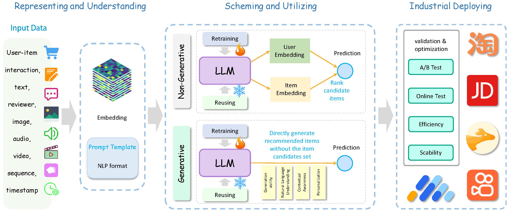

# Towards Next-Generation LLM-based Recommender Systems: A Survey and Beyond
The official GitHub page for the survey paper "Towards Next-Generation LLM-based Recommender Systems: A Survey and Beyond".

## Introduction

### Structure

### Pipeline

### Different paradigm

### LLM-using

## Industrial Deploying

1. [Breaking the Barrier: Utilizing Large Language Models for Industrial Recommendation Systems through an Inferential Knowledge Graph](https://arxiv.org/abs/2402.13750)
2. [A Large Language Model Enhanced Sequential Recommender for Joint Video and Comment Recommendation](https://arxiv.org/abs/2403.13574)
3. [RecGPT: Generative Personalized Prompts for Sequential Recommendation via ChatGPT Training Paradigm](https://arxiv.org/abs/2404.08675)
4. [Knowledge Adaptation from Large Language Model to Recommendation for Practical Industrial Application](https://arxiv.org/abs/2405.03988)
5. [Enhancing Sequential Recommendation via LLM-based Semantic Embedding Learning](https://dl.acm.org/doi/abs/10.1145/3589335.3648307)
6. [Actions speak louder than words: Trillion-parameter sequential transducers for generative recommendations](https://arxiv.org/abs/2402.17152)
7. [Breaking the length barrier: LLM-Enhanced CTR Prediction in Long Textual User Behaviors](https://dl.acm.org/doi/abs/10.1145/3626772.3657974)
8. [LLM4SBR: A Lightweight and Effective Framework for Integrating Large Language Models in Session-based Recommendation](https://arxiv.org/abs/2402.13840)
9. [A Decoding Acceleration Framework for Industrial Deployable LLM-based Recommender Systems](https://arxiv.org/abs/2408.05676)
10. [An Unified Search and Recommendation Foundation Model for Cold-Start Scenario](https://dl.acm.org/doi/abs/10.1145/3583780.3614657)
11. [Knowledge Adaptation from Large Language Model to Recommendation for Practical Industrial Application](https://arxiv.org/abs/2405.03988)
12. [DynLLM: When Large Language Models Meet Dynamic Graph Recommendation](https://arxiv.org/abs/2405.07580)
13. [COSMO: A large-scale e-commerce common sense knowledge generation and serving system at Amazon](https://dl.acm.org/doi/abs/10.1145/3626246.3653398)
14. [Modeling User Viewing Flow using Large Language Models for Article Recommendation](https://dl.acm.org/doi/abs/10.1145/3589335.3648305)
15. [Ad Recommendation in a Collapsed and Entangled World](https://dl.acm.org/doi/abs/10.1145/3637528.3671607)
16. [NoteLLM: A Retrievable Large Language Model for Note Recommendation](https://dl.acm.org/doi/abs/10.1145/3589335.3648314)
17. [Beyond Labels: Leveraging Deep Learning and LLMs for Content Metadata](https://dl.acm.org/doi/abs/10.1145/3604915.3608883)
18. [TRAWL: External Knowledge-Enhanced Recommendation with LLM Assistance](https://arxiv.org/abs/2403.06642)
19. [Heterogeneous Knowledge Fusion: A Novel Approach for Personalized Recommendation via LLM](https://dl.acm.org/doi/abs/10.1145/3604915.3608874)

## Challenges

